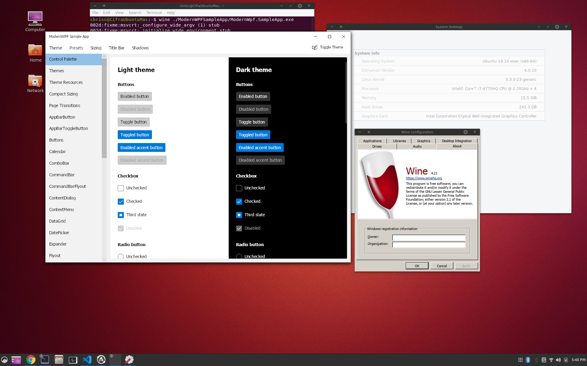

# A Developers Guide To Running WPF Apps On Linux With .NET Core and Wine

## Overview

I work on several large WPF applications that have been developed over many years. Our users only needed Windows support so WPF was an obvious choice at the time since it enabled a modern UI that ran on all Windows versions. Today our customers increasingly want to use or applications on Linux systems. We have been looking for a way to support our applications on Linux at an investment level that makes sense given the currently small, but growing, user base. And, of course, we want to maximize the investment we have already made with our WPF applications. There are several options that could be considered:

* Update the architecture of the applications to make the WPF specific code as small as possible and enable a per platform UI.  We can continue to use WPF on Windows and then choose something else for Linux.
* Switch to a cross platform UI stack. With libraries like QT we could create an app that would work cross platform.
* Switch to a HTML based UI stack. We could rearchitect our application to be an Electron app. Much of the non-UI code could be reused, but we would have to create the UI from scratch in HTML / JavaScript and update our architecture to support interop between JavaScript and our existing C# code.
* Switch to some sort of cloud hosted application.  Platforms like Amazon App Stream enable hosting of existing Windows apps and enables use from any platform.

After evaluation we were not happy with any of these solutions. They are either cost prohibitive or would result in a less desirable application. Given that the Linux customer base is somewhat of an unknown quantity we needed a solution that is initially low cost.  We also wanted a solution which provided a model that can evolve to support tailoring features to each platform as the user base grows. We went looking for a lower cost solution and we found one with Wine.

With the release of .NET Core 3.0 with support for WPF it is now possible to run a WPF app Linux by running the application under Wine. For those who have not heard of Wine before, it is a compatibility layer which allows you to run Windows applications on Linux and other OSes.
For more information you can read about Wine at their website: [WineHQ](https://www.winehq.org/)
Wine is used a lot to enable users to run games on Linux with requires Wine. To support gaming, the Wine team invested in providing a full featured implementation of DirectX.  This is great for WPF since it uses DirectX for rendering.

Wine is typically used to run applications out of the box. This is a high bar since any missing API or behavioral difference between Wine and Windows can result in an unusable app. If you are willing to thoroughly test and make necessary application changes, you can be successful running your WPF apps on Linux.  I have had great success getting several applications, including some very large WPF apps running on Linux with minimal changes.

## Getting Started

I theory a .NET Framework WPF application could be updated to run on Linux with Wine, but the .NET Framework license prohibits using it on any platform other than Windows. .NET Core is open source, MIT Licensed, and much more decoupled from Windows than .NET Framework. .NET Core is also where Microsoft is putting there investments these days. Given all of this the first step to get your application of Linux is to port it to .NET Core if it is not already on .NET Core. There are lots of great documents out there on how to port a WPF application to .NET Core. Microsoft's [Migration](https://docs.microsoft.com/en-us/dotnet/desktop-wpf/migration/convert-project-from-net-framework) page is a great place to start.

It is a lot easier to debug and fix issues on Windows than it is on Linux so make sure your application is working great on Windows before you try it on Linux.

### Install Wine on your Linux computer

.NET Core WPF Apps work well with current versions of Wine, but you may run into issues with older versions. I have been testing my apps with [Wine 4.21](https://www.winehq.org/news/2019112901).

Follow the instructions on the [Wine Installation](https://wiki.winehq.org/Download) page to install the Wine distribution which is compatible with your Linux distribution. I have had good success installing the development build available from WineHQ. Once wine is installed you need to set it up. Running winecfg will is an easy way to get wine to setup the configuration directory.


When setting up the configuration directory Wine will prompt you to install Mono. You do not need to install Mono .NET to run .NET Core applications. You can cancel the install of Wine Mono.  Wine Gecko is also not needed.


Once wineconfig is up and running you should have a .wine directory in your home directory:


### Install .NET Core on Wine

I find the easiest way to install .NET Core is to just copy the dotnet directory from your Windows install to the Linux computer.

Copy the entire dotnet folder from the Program Files directory on Windows:


to the Program Files directory in the Wine configuration location:


### Install your app on Linux

You can just copy the Windows build to anywhere on your Linux machine.  I usually copy the app into my home directory for testing.

### Make sure you have fonts installed

When testing out various applications I often experienced odd crashes when an appropriate font was not available.  For testing purposes the easiest way to get necessary fonts is with [Winetricks](https://wiki.winehq.org/Winetricks).  Install Winetricks and then run it. From there you can install fonts available from a variety of sources.

### Run your app under Wine

Once you app is copied to the Linux machine you can run it under Wine:

``` text
wine {location name of your app}
```

Here is a picture of the [Modern WPF](https://github.com/Kinnara/ModernWpf) example application running on Linux


This application runs unmodifed on Linux.

**Note:** I have only testing 64bit applications.

## Calling native code

You can customize your .NET app for Linux and call into native linux code with P/Invokes in your .NET code. The key is to create addition Wine DLLs that then call into linux libraries.

The easiest way I have found to do this is to download and build the Wine source and then follow the patterns of the built-in DLLs.  The Wine [Developer Hints](https://wiki.winehq.org/Developer_Hints#Implementing_a_new_DLL) page has information on how to implement a new DLL.  You can follow these instructions to create a DLL that is specific for your application.

Lets say you have a .so (examplelibrary.so) that has a method like this:

``` cpp

extern "C" int GetSystemInformation(char* systemInformation) {
    // Implementation
}

```

that you want to call into.  To call into it you need to make an equivalent DLL version (winExampleLibrary) that you can then pInvoke to:

``` cpp

LONG WINAPI GetSystemInformation(char* systemInformation) {
    if (!impl_handle) {
        impl_handle = wine_dlopen("examplelibrary.so", RTLD_NOW, NULL, 0);
        if (impl_handle == NULL)
            return -1;
        pGetSystemInformation = wine_dlsym(impl_handle, "GetSystemInformation", NULL, 0);
    }
    if (pGetSystemInformation == NULL)
        return -1; 
    return pGetSystemInformation(systemInformation);
}

```

Then pInvoke normally

``` csharp

[DllImport(winExampleLibrary")]
private extern static unsafe int GetSystemInformation(byte* data);

```

## What do you do if the app does not work

I have not been able to get a debugger working with .NET Core apps running under Wine so you will have to rely on logging methods to debug issues that you run into.

### Console.Writeline

Use Console.WriteLine to log any information you may need to debug issues. I highly recommend adding generous amounts of logging, asserts, and verification to your app.  When catching unexpected excetions be sure to log the exception and call stack from the exception so you can easily determine the location of the error.

I reccommend installing general exception handlers you can you catch unhandled exceptions and log them as well.

Dispatcher has an [UnhandledException](https://docs.microsoft.com/en-us/dotnet/api/system.windows.threading.dispatcher.unhandledexception?view=netcore-3.0) event can be registed and used to log any unhandled exceptions from the dispatcher.

AppDomain also has an [UnhandledException](https://docs.microsoft.com/en-us/dotnet/api/system.appdomain.unhandledexception?view=netcore-3.0) event that can also be used to log any unhandled exceptions.

### Wine Tracing

Wine is good at letting you know when your application calls unimplemented or partially implemented functionality.  These messages can greatly aid in tracking down issues.

In addition to the standard tracing of Wine you can configure even more event logging, including logging every call into Wine, to help you track down issues.  You can learn more about debug logging [Here](https://wiki.winehq.org/Wine_Developer%27s_Guide/Debug_Logging)

Also the Wine [Debugging Hints](https://wiki.winehq.org/Debugging_Hints) may provide some insights.

## Issues I ran into

### Rendering Issues with different Video Cards

I have experienced render issues depending on what manufacturer of video card I am using.
Nvidia cards do the best with only minor render issues.  Amd cards also do a decent job.  Intel video is basically unusable.  If you experience render issues (artifacts, clipping issues, ...) you will likely have better luck if you switch to software rendering.  You can do this by setting LIBGL_ALWAYS_SOFTWARE to 1.

``` text
export LIBGL_ALWAYS_SOFTWARE=1
```

#### HTTP Listener

The default HTTPListener for Windows uses Windows APIs as part of the implementation. Unfortunately Wine does not implement the required APIs. Luckily System.Net.HttpListener.dll can also be built so that it does not use the Windows APIs.  I setting

``` XML
<ForceManagedImplementation>true</ForceManagedImplementation>
```

in the project file produces a version of HTTPListener that works on Linux.

#### Other issues

I ran into several other issues like culture enumeration and file system security APIs crashing.  These were all easily worked around in my applications so I did not investigate them further.

The great thing is that source is available for everything (Wine, .NET Core, WPF) so it much easier to debug and fix issues than I originally expected. Fixes can also be made at any level in the stack to get and app working.

## Will WPF apps run on other OSes

WPF runs on DirectX 9 so any build of Wine with a reasonable DirectX support. At this point I have only tried Linux.

## Whats Next

When you run a WPF application on Linux as documented here you end up with an application that is something like this:


It would be great to be able to switch to .NET Core for Linux, keep using WPF, and have WPF Apps continue to work for the most part.  Then the appliations would have a boxology like this


To do this WPF needs to be updated to compile against [WineLib](https://wiki.winehq.org/Winelib_User%27s_Guide). In theory this should not be too difficult, but I have not tried this at all yet.

Switching to the Linux version of .NET Core would enable debugging and calling into native libraries without having to create a Wine wrapper DLL.
