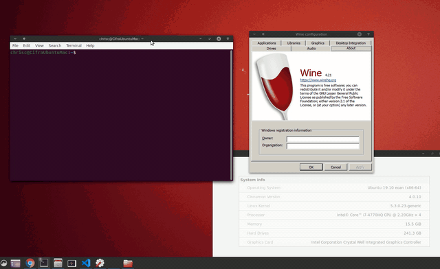

# A developers guide to running WPF apps on Linux with .NET Core and Wine

## Overview

I have worked on several large WPF applications that took many years to create. When we started development, our users only used Windows, which made WPF a natural choice. WPF provides a modern UI and workflow that ran on all versions of Windows. Today, our customers increasingly want to use our applications on Linux, so we have been looking for a way to achieve this at an investment level that makes sense given the current size of the user base. With this shift, we are also looking to maximize the investments we have already made with our WPF applications. To move to Linux, we considered several options:

* Update the architecture of the applications to make the WPF-specific code as small as possible, and enable a per-platform UI. We could continue to use WPF on Windows and choose something else for Linux.
* Switch to a cross-platform UI stack. With libraries like QT, we could create an app that would work cross-platform.
* Switch to a HTML-based UI stack. We could rearchitect our application to be an Electron app. Much of the non-UI code could be reused, but we would have to recreate the UI from scratch in HTML / JavaScript and update our architecture to support interop between JavaScript and our existing C# code.
* Switch to some sort of cloud-hosted application. Platforms like Amazon App Stream enable hosting of existing Windows apps and enable use from any platform.

After some evaluation, we were not happy with any of these solutions. They were either cost prohibitive or would have resulted in a less desirable application. Given the size of the Linux customer base, we needed a solution that is initially low cost, and provided a model that could evolve to support tailoring features to each platform as the user base grows. We found the solution to these problems with Wine.

With .NET Core 3.0's support for WPF, a WPF application can run on Linux under Wine. Wine is a compatibility layer which allows Windows applications on Linux and other OSes, include .NET Core Windows applications.
More information about Wine is available at the [WineHQ](https://www.winehq.org/) website.

Wine is often used to enable users to run games on Linux. In order  to support gaming, the Wine team invested in providing a full-featured implementation of DirectX. This is great for WPF, since it uses DirectX for rendering, and, from the rendering perspective, is a lot like a DirectX game.

Wine is typically used to run applications out of the box. This is a high bar, since any missing API or behavioral difference between Wine and Windows can result in an unusable app. If you are willing to thoroughly test and make necessary application changes, you can be successful running your WPF apps on Linux. I've had great success getting several applications, including some very large WPF apps, running on Linux with minimal changes.

## Getting started

### Port to .NET Core

In theory, a .NET Framework WPF application could be updated to run on Linux with Wine. However, .NET Framework's license prohibits use on any platform other than Windows. .NET Core is open source and cross-platform. .NET Core is also where Microsoft is putting their .NET investment, so porting to .NET Core is a good idea even for Windows-only use. Given the issues with .NET Framework, the first step towards Linux support is to port your application to .NET Core. There are many great documents available on how to port a WPF application to .NET Core. Microsoft's [Migration](https://docs.microsoft.com/en-us/dotnet/desktop-wpf/migration/convert-project-from-net-framework) page is a great place to start.

It's much easier to debug and fix issues on Windows than on Linux, so make sure your application is working well on Windows before you try it on Linux.

### Install Wine

.NET Core WPF Apps work well with current versions of Wine, but you may run into issues with older versions. I have been testing my apps with [Wine 4.21](https://www.winehq.org/news/2019112901).

Follow the instructions on the [Wine Installation](https://wiki.winehq.org/Download) page to install a Wine package that is compatible with your Linux distribution. I've  had success installing the development build available from WineHQ directly. Once Wine is installed, you need to set it up. Running `winecfg` is an easy way to get Wine to setup the Wine prefix (configuration) directory.


When setting up the Wine prefix directory, Wine will prompt you to install Mono. You do not need to install Mono .NET to run .NET Core applications, so you can cancel the install of Wine Mono. Wine Gecko is also not needed.


Once wineconfig is running, there should be a .wine directory in your home directory:


Nothing needs to be changed in WineConfig so it can be closed.

### Setup .NET Core on Wine

The easiest way to install .NET Core for testing is to copy the dotnet directory from your Windows install to the Linux computer.

Copy the entire dotnet folder from the Program Files directory on Windows:


to the Program Files directory in the Wine configuration location:


### Install / copy your application to Linux

Applications that can run from the build output directory can be copied from Windows to anywhere on your Linux machine. I usually copy the application into my home directory for testing. Wine also supports setting registry keys or environment variables. If your required setup has more complex requirements, you may have more difficulty, but Wine supports a surprising number of Windows features.

### Make sure fonts are available

When testing out various applications, I often experienced odd crashes when an appropriate font was not available. For testing purposes, the easiest way to get necessary fonts is with [Winetricks](https://wiki.winehq.org/Winetricks). Install and run Winetricks. From there, you can install fonts available from a variety of sources.

### Run your application under Wine

Once your app is copied to the Linux machine, you can run it under Wine:

``` text
wine {location name of your app}
```

Here is a screen capture [Modern WPF](https://github.com/Kinnara/ModernWpf) example application running on Linux:



This application runs unmodified on Linux.

**Note:** I have only tested 64-bit applications.

## Calling native code

You can customize your .NET app for Linux and call into native linux code with P/Invokes in your .NET code. The key is to create addition Wine DLLs that then call into Linux libraries.

The easiest way I have found to do this is to download and build the Wine source and then follow the patterns of the built-in DLLs. The Wine [Developer Hints](https://wiki.winehq.org/Developer_Hints#Implementing_a_new_DLL) page has information on how to implement a new DLL. You can follow these instructions to create a DLL for your application. 

Lets say you have a .so (examplelibrary.so) that has a method like this:

``` cpp

extern "C" int GetSystemInformation(char* systemInformation) {
    // Implementation
}

```

that you want to call into. To call into it, you need to make an equivalent DLL version (winExampleLibrary) that you can then pInvoke to:

``` cpp

LONG WINAPI GetSystemInformation(char* systemInformation) {
    if (!impl_handle) {
        impl_handle = wine_dlopen("examplelibrary.so", RTLD_NOW, NULL, 0);
        if (impl_handle == NULL)
            return -1;
        pGetSystemInformation = wine_dlsym(impl_handle, "GetSystemInformation", NULL, 0);
    }
    if (pGetSystemInformation == NULL)
        return -1; 
    return pGetSystemInformation(systemInformation);
}

```

Then pInvoke normally:

``` csharp

[DllImport(winExampleLibrary")]
private extern static unsafe int GetSystemInformation(byte* data);

```

## What to do if your application does not work

Most debuggers will not work to debug a .NET Core apps running under Wine.  I have tried remote debugging with Visual Studio and Visual Studio Code without success.  One debugger that does work is is [dnSpy](https://github.com/0xd4d/dnSpy).  It is a very nice debugger that can run under Wine and debug .NET Core applications that are also running under Wine.

To use dnSpy run it under wine just like any other application:

``` text
cd {location of dnSpy}
wine dnSpy.exe
```

Once dnSpy is running you should be able to attach to any .NET Core application that is running under wine.

In addition to using dnSpy, logging is often a convenient way to debug issues that you run into.

### Console.WriteLine

Use Console.WriteLine to log any information you may need to debug issues. I highly recommend adding generous amounts of logging, asserts, and verification to your app. When catching unexpected exceptions, be sure to log the exception and call stack from the exception so you can easily determine the location of the error.

I recommend installing general exception handlers you can you catch unhandled exceptions and log them as well.

Dispatcher has an [UnhandledException](https://docs.microsoft.com/en-us/dotnet/api/system.windows.threading.dispatcher.unhandledexception?view=netcore-3.0) event that can be registered and used to log any unhandled exceptions from the dispatcher.

AppDomain also has an [UnhandledException](https://docs.microsoft.com/en-us/dotnet/api/system.appdomain.unhandledexception?view=netcore-3.0) event that can be used to log any unhandled exceptions.

### Wine Tracing

Wine is good at letting you know when your application calls unimplemented or partially implemented functionality. These messages can greatly aid in tracking down issues.

In addition to the standard tracing of Wine, you can configure even more event logging, including logging every call into Wine, to help you track down issues. More information about debug logging is available on Wine HQ's [Developer Guide](https://wiki.winehq.org/Wine_Developer%27s_Guide/Debug_Logging)

The Wine [Debugging Hints](https://wiki.winehq.org/Debugging_Hints) may also provide some insights.

## Issues I ran into

### Rendering issues with different video cards

I have experienced render issues depending on which manufacturer of video card I am using. NVIDIA does the best with only minor render issues. AMD does a decent job. Intel is basically unusable. If you experience render issues (artifacts, clipping issues, ...) you will likely have better luck if you switch to software rendering. You can do this by setting LIBGL_ALWAYS_SOFTWARE to 1.

``` text
export LIBGL_ALWAYS_SOFTWARE=1
```

With the applications I have tested using software rendering does not impact performance of the UI much at all, but it may increase CPU usage.

### HTTP Listener

The default HTTPListener for Windows uses Windows APIs as part of its implementation. Unfortunately, Wine does not implement the required APIs. Luckily, System.Net.HttpListener.dll can be built so that it does not use the Windows APIs. Setting:

``` XML
<ForceManagedImplementation>true</ForceManagedImplementation>
```

in the project file produces a version of HTTPListener that works on Linux.

### Other issues

I ran into several other issues, like culture enumeration and file system security APIs crashing. These were all easily worked around in my applications, so I didn't investigate them further.

The great thing is that source is available for everything (Wine, .NET Core, WPF), so it is much easier to debug and fix issues than I expected. Fixes can also be made at any level in the stack to get an app working.

## Will WPF apps run on other OSes?

WPF runs on DirectX 9, so any build of Wine with reasonable DirectX support should be able to run a WPF app. I have only tried Linux.

## Whats Next?

When you run a WPF application on Linux as documented here, you end up with an application that is something like this:


* Blue - Windows build libraries
* Green - .NET assemblies
* Gray - Native Linux libraries

This is a pretty good place to be. The vast majority of code is shared between Windows and Linux. The application runs as a Linux process, integrates well with desktop environments, and has access to the file system and many OS services. However, this model does have challenges. Calling native code requires special work, and not having a debugger can make finding and fixing issues difficult.

It would be great to be able to switch to .NET Core for Linux, keep using WPF, and have WPF applications continue to work. Then the applications would have a boxology like this


* Blue - Windows build libraries
* Green - .NET assemblies
* Gray - Native Linux libraries

In this case, the application is a standard .NET Core application for Linux. It should be debuggable by any .NET debugger that supports Linux. Calling into native libraries would not require the creation Wine wrapper DLLs.

To do this, WPF needs to be updated to compile against [WineLib](https://wiki.winehq.org/Winelib_User%27s_Guide). In theory, this should not be too difficult. Hopefully, I will have time in the near future to work on this.
